<p align="center">
  <a href="README.md">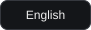</a>
  <a href="README.es.md">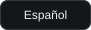</a>
  <a href="README.pt-BR.md">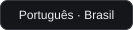</a>
</p>

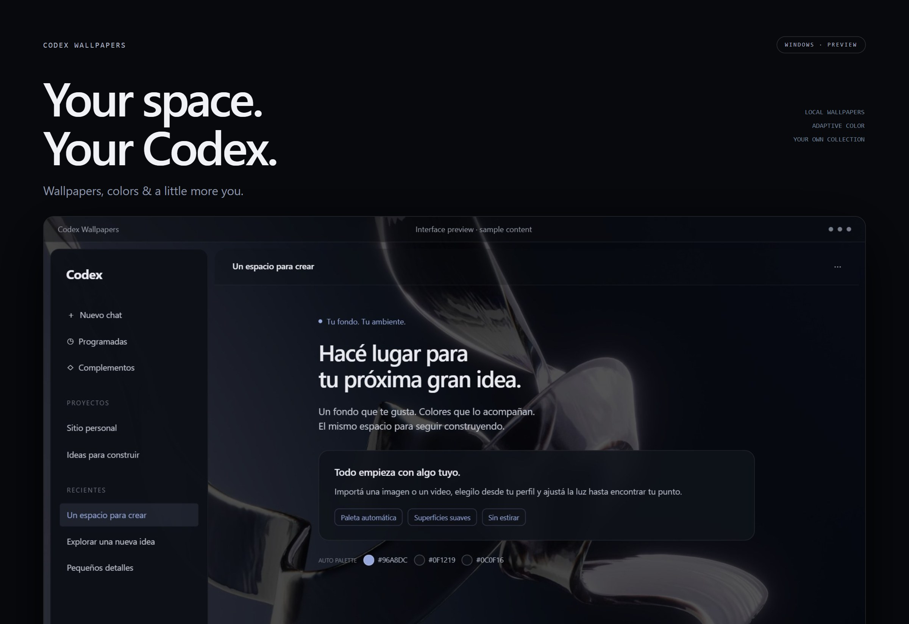

**Deixe o Codex com a sua cara.** Escolha uma imagem ou um vídeo e deixe as cores acompanharem o fundo. Troque o papel de parede em **Perfil → Fondos** e ajuste brilho, transparência e cantos.

## A mesma interface. Outro clima.

Estas prévias usam papéis de parede de uma coleção pessoal e conteúdo de exemplo. As cores de destaque, da barra lateral e do compositor são geradas a partir de cada fundo: compare as amostras abaixo da mensagem. Clique em uma imagem para ampliar.

| Glass Ribbons | MacOS Style |
| :---: | :---: |
| [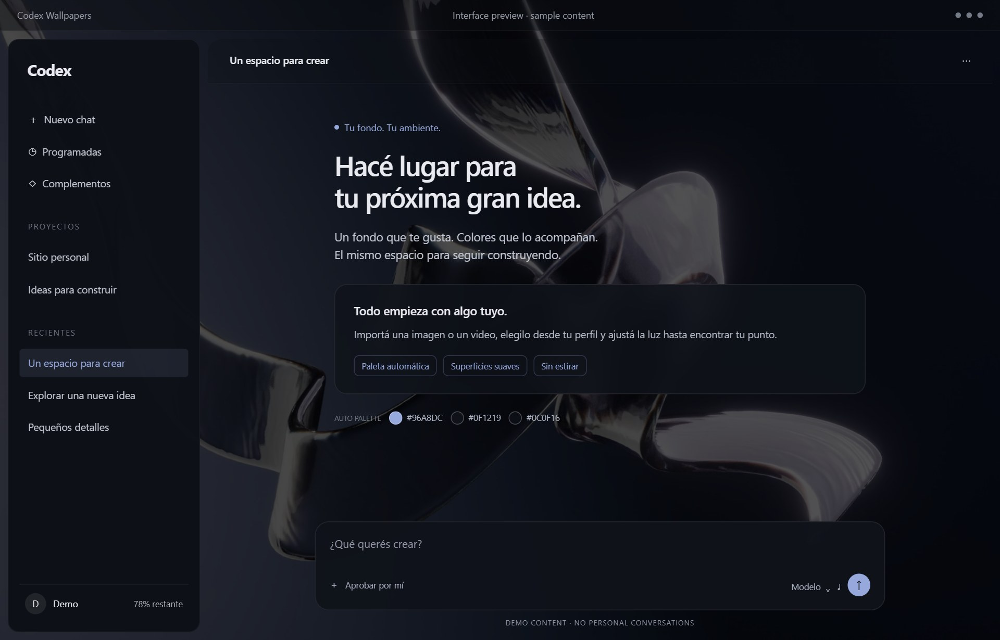](docs/assets/gallery-glass-ribbons.jpg) | [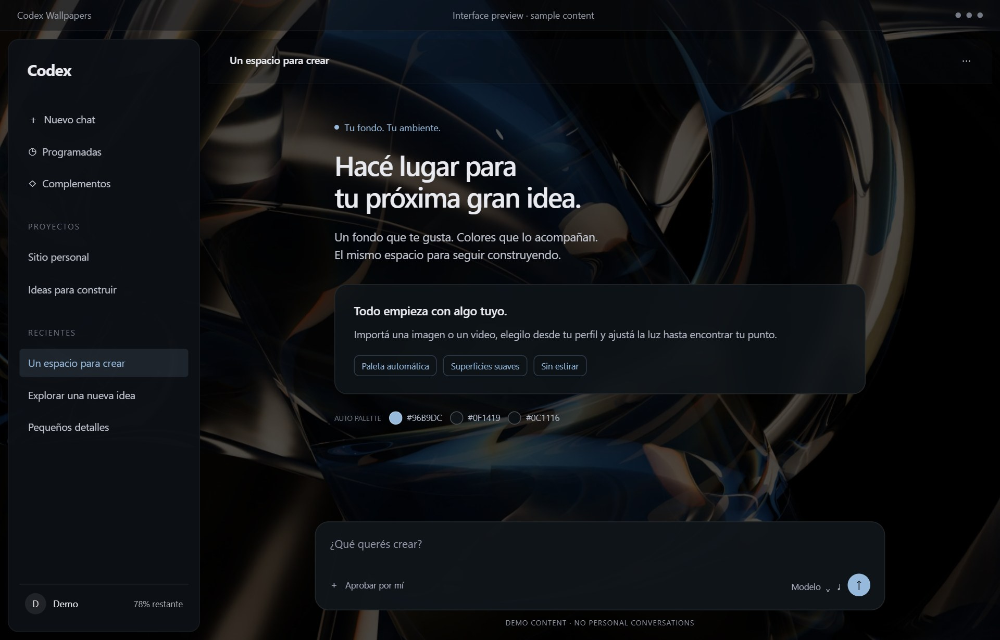](docs/assets/gallery-macos-style.jpg) |
| **MacOs M3** | **Mac Baconai** |
| [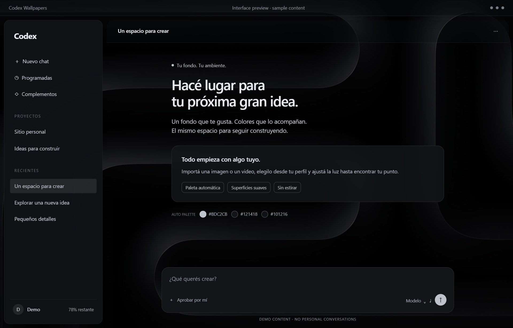](docs/assets/gallery-macos-m3.jpg) | [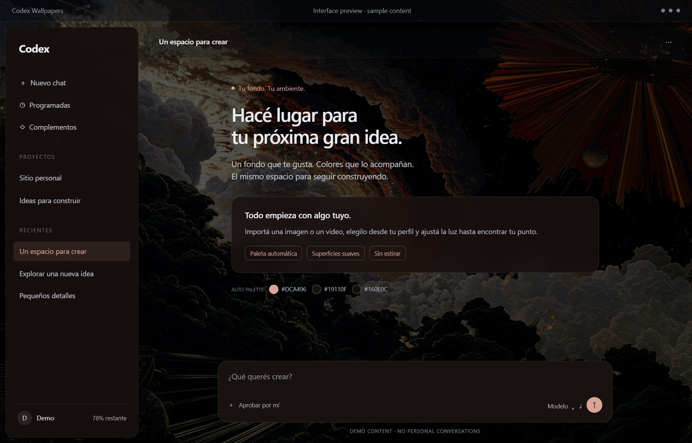](docs/assets/gallery-mac-baconai.jpg) |
| **Red Torii** | **CHR0NIC** |
| [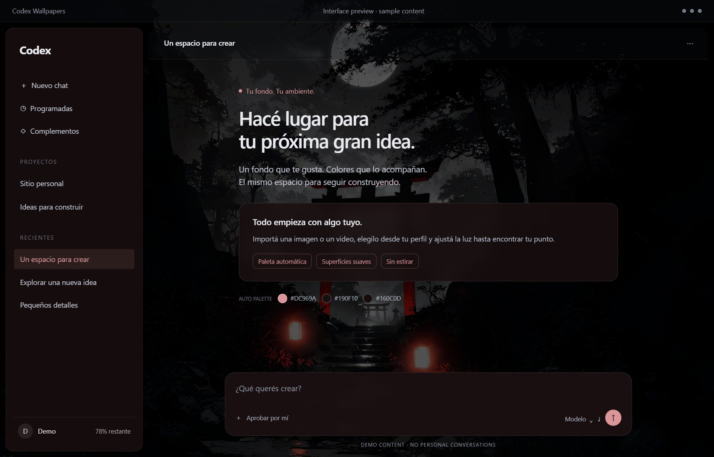](docs/assets/gallery-red-torii.jpg) | [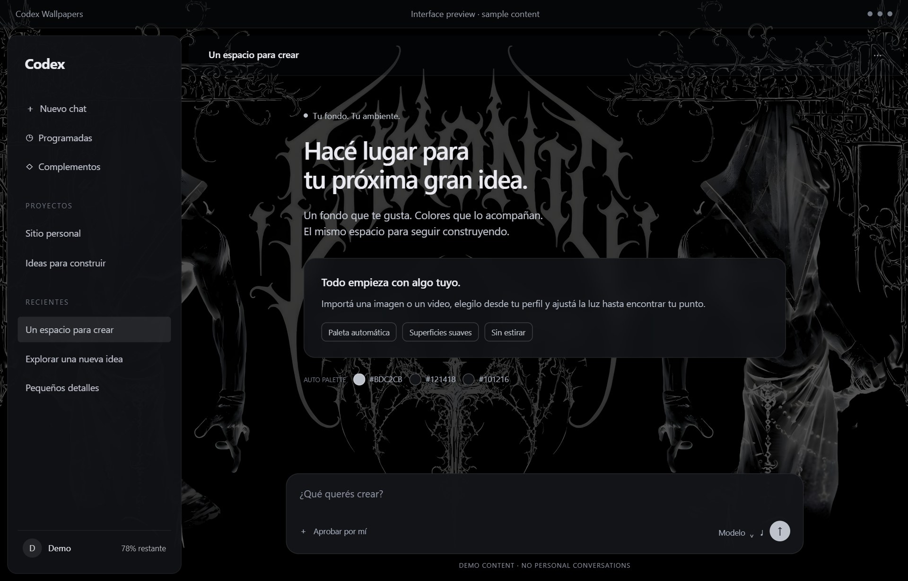](docs/assets/gallery-chronic.jpg) |

A galeria mostra exemplos; os fundos não vêm incluídos. [Créditos dos papéis de parede](docs/assets/README.md).

## Sua coleção, a um clique

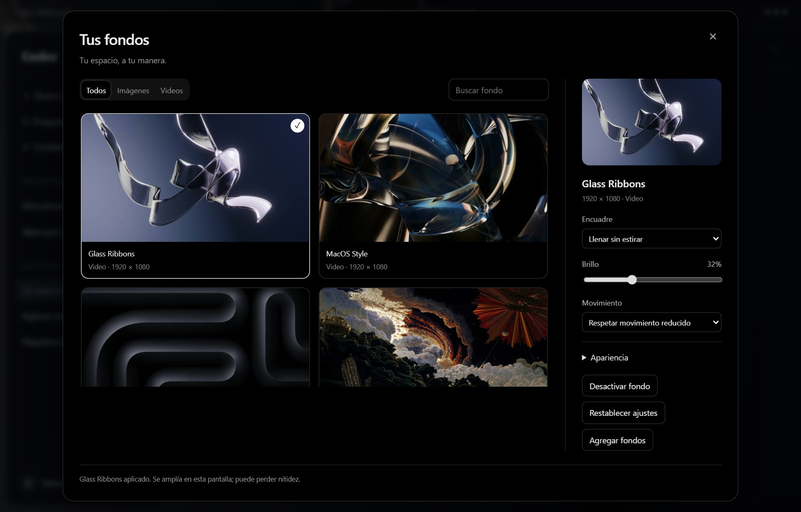

- **Seus arquivos:** JPG, PNG, WebP, MP4 e WebM. Os vídeos ficam em loop, sem som.
- **Suas cores:** paleta automática ou manual, opacidade e cantos ajustáveis.
- **Seu espaço:** enquadramento sem distorção, preferências salvas e suporte a várias janelas.
- **Memória controlada:** cada janela recebe as miniaturas do catálogo e apenas o wallpaper completo em uso. Janelas ocultas aguardam antes de carregar animações.

## Começar

Você precisa do Codex Desktop para Windows, Node.js 22+ e FFmpeg/ffprobe para importar arquivos. Na pasta deste repositório, execute:

```powershell
powershell.exe -NoProfile -ExecutionPolicy Bypass -File .\windows\install.ps1
```

Abra **Codex Wallpapers** pelo menu Iniciar na próxima vez que abrir o Codex. Fixe **esse atalho** na barra de tarefas: ele usa o ícone oficial da sua instalação e abre o mesmo aplicativo com a personalização. O atalho original continua disponível. [Detalhes do atalho e do ícone (ES)](docs/WINDOWS.md).

Anexe uma imagem ou um vídeo ao seu agente no Codex e peça:

> Importe este fundo no codex-wallpapers, preserve o original e confira a resolução. Não reinicie o Codex sem me perguntar.

Depois, escolha o fundo em **Perfil → Fondos**. A biblioteca começa vazia. Recomendamos **Wallpaper Engine no Steam** como fonte: use uma imagem ou um vídeo local que você tenha permissão para usar. Cenas do Workshop precisam de uma imagem ou de um vídeo gravado/exportado. [Guia de mídia (ES)](docs/MEDIA.md).

## Segurança e status

**Projeto independente e experimental.** Aplica CSS/JavaScript por meio da depuração local do Electron. Não é um plugin oficial nem foi aprovado pela OpenAI; não há garantia de compatibilidade ou de ausência de restrições na conta. [Segurança e escopo](docs/SECURITY.pt-BR.md).

**Preview:** os testes isolados de transferência, interface e atalho do Windows passaram. A biblioteca completa não é mais copiada para cada renderer. A inicialização em uma instalação limpa ainda precisa de validação manual. Se a personalização falhar, o Codex continua aberto; o projeto nunca reinicia o aplicativo para tentar se recuperar.

[Guia do agente (ES)](docs/AGENT.md) · [Atualizações (ES)](docs/UPDATES.md) · [Testes (ES)](docs/TESTING.md) · [Licença MIT do código](LICENSE)
